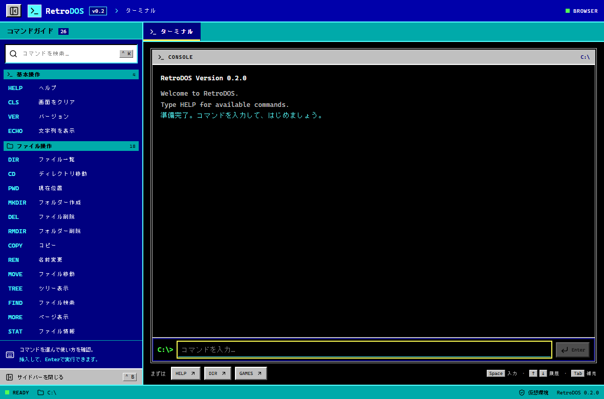

# RetroDOS

MS-DOS風のコマンド操作と、現代的なデスクトップUIを組み合わせた仮想ワークスペースです。

React + TypeScriptによるブラウザー版と、Tauri v2によるWindowsデスクトップ版を同じコードベースで提供します。現在のバージョンは **v0.2.0** です。



## 主な機能

- 青とシアンを基調にしたMS-DOS風UI
- キーボード中心のコマンド操作、履歴、Tab補完
- 開いているアプリやファイルだけを表示するタスク型タブ
- `C:\`から始まる永続的な仮想ファイルシステム
- ファイル・フォルダーの作成、編集、検索、コピー、移動、削除
- `*`と`?`を使ったワイルドカード削除
- 最大20件の永続UNDO履歴
- Vim風の内蔵テキストエディタ
- 長文をページ単位で閲覧できるMOREページャー
- 仮想ドライブのJSONエクスポート・インポート
- キーボードだけで選択・操作できるゲームライブラリ
- 内蔵数当てゲーム「GUESS」
- 520px幅から利用できるレスポンシブUI

RetroDOSが扱うファイルは、アプリ内の仮想データです。実PC上のファイルやOSコマンドを直接操作しません。

## クイックスタート

### 必要環境

- Node.js 22.12以降
- npm

依存関係は`package-lock.json`に固定しています。

### ブラウザー版

```powershell
npm ci
npm run dev
```

ブラウザーで <http://127.0.0.1:1420> を開きます。終了するときは、開発サーバーを実行しているターミナルで`Ctrl+C`を押します。

### Windowsデスクトップ版

Windows版の開発とビルドには、次の環境も必要です。

- Rust MSVCツールチェーン
- Microsoft C++ Build Tools
- Microsoft Edge WebView2 Runtime

詳しくは[Tauri v2の前提条件](https://v2.tauri.app/start/prerequisites/)を参照してください。

開発版を起動します。

```powershell
npm run desktop:dev
```

本番用の単体exeを生成します。

```powershell
npm run desktop:build
```

生成先は`src-tauri/target/release/retrodos.exe`です。Webアセットを内蔵しているため、Vite開発サーバーを起動せずに実行できます。

NSISインストーラーを生成する場合は、次のコマンドを使用します。

```powershell
npm run tauri -- build
```

`npm run dev`と`npm run desktop:dev`は1420番ポートを共有します。同時には起動しないでください。

## 基本操作

| 操作 | キー |
| --- | --- |
| コマンドを実行 | `Enter` |
| 入力履歴を移動 | `↑` / `↓` |
| コマンド名・別名を補完 | `Tab` |
| 複数の補完候補を選択 | `Tab` / `Shift+Tab` / `↑` / `↓` |
| 補完候補を入力欄へ挿入 | `Enter` |
| 補完候補を閉じる | `Esc` |
| コマンド検索へ移動 | `Ctrl+K` |
| サイドバーを開閉 | `Ctrl+B` |
| ターミナル表示をクリア | `Ctrl+L` |
| 現在画面の入力欄へ移動 | 入力欄・ボタン以外で`Space` |

サイドバーでは、コマンド名、別名、日本語名、説明を検索できます。「入力欄に挿入」はコマンドをセットするだけで、実行にはもう一度`Enter`が必要です。

過去のログを読んでいる間は、新しい出力があっても強制的に最下部へ移動しません。「新しい出力」ボタンで最新位置へ戻れます。

## コマンド一覧

### 基本操作

| コマンド | 使用例 | 機能 |
| --- | --- | --- |
| `HELP` | `HELP` / `HELP CD` | コマンド一覧または詳細を表示 |
| `CLS` | `CLS` | ターミナルの表示履歴を消去 |
| `VER` | `VER` | RetroDOSのバージョンを表示 |
| `ECHO` | `ECHO "こんにちは 世界"` | 指定した文字列を表示 |

### ファイル・フォルダー操作

| コマンド | 使用例 | 機能 |
| --- | --- | --- |
| `DIR` | `DIR` / `DIR C:\DOCS` | ファイルとフォルダーを一覧表示 |
| `CD` | `CD DOCS` / `CD ..` | 現在のフォルダーを変更 |
| `PWD` | `PWD` | 現在位置を表示 |
| `TREE` | `TREE` / `TREE DOCS` | フォルダー構造をツリー表示 |
| `FIND` | `FIND RetroDOS` | ファイル名と本文を再帰検索 |
| `TYPE` | `TYPE README.TXT` | テキストファイルをターミナルへ表示 |
| `MORE` | `MORE DOCS\COMMANDS.TXT` | テキストをページ単位で閲覧 |
| `STAT` | `STAT README.TXT` | 種類、サイズ、作成日時、更新日時を表示 |
| `MKDIR` | `MKDIR NOTES` | フォルダーを作成 |
| `VIM` | `VIM MEMO.TXT` | Vim風エディタで作成・編集 |
| `COPY` | `COPY A.TXT B.TXT` | ファイルまたはフォルダーをコピー |
| `REN` | `REN OLD.TXT NEW.TXT` | ファイルまたはフォルダーの名前を変更 |
| `MOVE` | `MOVE NOTE.TXT DOCS` | ファイルまたはフォルダーを移動 |
| `DEL` | `DEL *.TXT` | ファイルを削除。`*`と`?`に対応 |
| `RMDIR` | `RMDIR EMPTY` | 空のフォルダーを削除 |
| `RMDIR /S` | `RMDIR /S OLD` | フォルダーを中身ごと削除 |
| `UNDO` | `UNDO` | 直前のファイル操作を取り消す |
| `EXPORT` | `EXPORT DRIVE.JSON` | 仮想ドライブをJSONへ書き出す |
| `IMPORT` | `IMPORT` | JSONから仮想ドライブを復元 |

### ゲームとシステム

| コマンド | 使用例 | 機能 |
| --- | --- | --- |
| `GAMES` | `GAMES` | ゲームライブラリを開く |
| `RUN` | `RUN GUESS` | 指定した内蔵ゲームを起動 |
| `DATE` | `DATE` | 現在の日付をJSTで表示 |
| `TIME` | `TIME` | 現在の時刻をJSTで表示 |

### コマンドの別名

| 本来のコマンド | 別名 |
| --- | --- |
| `HELP` | `?` |
| `CLS` | `CLEAR` |
| `VER` | `VERSION` |
| `CD` | `CHDIR` |
| `MKDIR` | `MD` |
| `DEL` | `ERASE` |
| `RMDIR` | `RD` |
| `REN` | `RENAME` |
| `VIM` | `EDIT` |
| `STAT` | `INFO` |

コマンド名とパスは大文字・小文字を区別しません。空白を含む引数は引用符で囲みます。

```text
TYPE "C:\DOCS\WELCOME NOTE.TXT"
VIM "C:\DOCS\MY NOTE.TXT"
MKDIR "MY FILES"
```

## 仮想ファイルシステム

仮想ドライブは`C:`のみです。絶対パス、ルート基準のパス、相対パス、`.`、`..`を使用できます。

```text
C:\
├── GAMES\
│   └── GUESS.TXT
├── DOCS\
│   ├── COMMANDS.TXT
│   └── WELCOME NOTE.TXT
├── SYSTEM\
│   └── VERSION.TXT
└── README.TXT
```

ファイルとフォルダーの変更、および最大20件のUNDO履歴はローカルに保存されます。アプリを再起動しても内容は残ります。

### ワイルドカード

`DEL`では、ファイル名部分に`*`と`?`を使用できます。

```text
DEL *.TXT
DEL TEMP-?.LOG
DEL DOCS\OLD-*.TXT
```

ワイルドカードで削除した複数ファイルは、1回の`UNDO`でまとめて復元できます。

### ドライブのバックアップ

仮想ドライブ全体をJSONとして保存します。

```text
EXPORT
EXPORT MY-DRIVE.JSON
```

復元するときは`IMPORT`を実行し、書き出したJSONファイルを選択します。取り込み操作も`UNDO`で元に戻せます。インポートできるファイルは1MB以下です。

## Vim風エディタ

`VIM <ファイル名>`で起動すると、上部に開いたファイル名のタブが表示されます。ターミナルへ切り替えても編集状態は保持され、タブの`×`で閉じられます。

| 操作 | キー・コマンド |
| --- | --- |
| INSERTモードへ移動 | `i` / `a` / `o` |
| NORMALモードへ戻る | `Esc` |
| カーソル移動 | `h` / `j` / `k` / `l` |
| 1文字削除 | `x` |
| 1行削除 | `dd` |
| 元に戻す | `u` |
| 保存 | `:w` |
| 終了 | `:q` |
| 保存して終了 | `:wq` |
| 変更を破棄して終了 | `:q!` |

未保存の変更がある状態で`:q`を実行すると警告を表示します。

## MOREページャー

`MORE <ファイル名>`で長いテキストを開きます。

| 操作 | キー |
| --- | --- |
| 次のページ | `Space` / `PageDown` |
| 1行進む | `Enter` / `↓` |
| 前のページ | `B` / `PageUp` |
| 1行戻る | `↑` |
| 先頭・末尾 | `Home` / `End` |
| 終了 | `Q` / `Esc` |

## ゲームライブラリ

`GAMES`でゲームライブラリを開きます。ゲームコード、番号、矢印キーのいずれでも選択できます。

| 操作 | キー |
| --- | --- |
| コードで選択 | `GUESS`を入力して`Enter` |
| 番号で選択 | `1`を入力して`Enter` |
| 選択を移動 | `↑` / `↓` / `←` / `→` |
| 選択中のゲームを起動 | `Enter` |
| ライブラリ・ゲームを終了 | `Esc` |

GUESSは1から100までの秘密の数字を当てるゲームです。候補範囲、ヒント、予想履歴、試行回数を表示します。

## テストと検証

```powershell
npm test
npm run typecheck
npm run build
npm run test:e2e
npm run desktop:build
npm run test:desktop
```

| コマンド | 確認内容 |
| --- | --- |
| `npm test` | パーサー、パス、仮想ストレージ、ファイル操作、UNDO、検索、ゲームロジック |
| `npm run typecheck` | TypeScriptの型整合性 |
| `npm run build` | Vite本番ビルド |
| `npm run test:e2e` | Edge上でコマンド、Vim、MORE、入出力、ゲーム、リサイズを操作 |
| `npm run desktop:build` | TauriのWindows releaseビルド |
| `npm run test:desktop` | 実際のWebView2でデスクトップ版を起動・操作 |

現在の検証結果は、Vitest **80件成功**、Playwright **10件成功**です。

## プロジェクト構成

```text
src/
├── app/                     アプリ構成と画面名
├── components/
│   ├── layout/              タイトルバーとタブ
│   ├── sidebar/             コマンド検索と詳細
│   ├── statusbar/           パスと実行状態
│   └── terminal/            ターミナル入出力
├── features/
│   ├── commands/            コマンド定義、解析、実行
│   ├── filesystem/          仮想FS、永続化、MORE、入出力
│   ├── games/               ゲームライブラリとGUESS
│   └── vim/                 Vim風エディタ
├── hooks/                   ワークスペースと入力状態
├── services/                実行環境の判定
├── styles/                  MS-DOS風テーマとレイアウト
└── types/                   共通型

src-tauri/                  Tauri v2のRustコードと設定
tests/e2e/                  Playwright操作テスト
scripts/                    デスクトップ検証と画面キャプチャ
docs/                       実装記録とスクリーンショット
```

コマンドは`src/features/commands/registry.ts`へ登録します。HELP、サイドバー、検索、補完は同じ定義を参照するため、追加内容が自動的に反映されます。

## 現在の範囲

v0.2.0では、仮想ファイルの作成・編集・削除・コピー・移動・検索・情報表示、UNDO、JSON入出力に対応しています。

次の機能は今後の対象です。

- 入力履歴、現在位置、ゲーム途中状態の再起動後の保存
- 外部DOSゲームの登録と起動
- DOSBoxとの連携
- 配布用インストーラーの署名と公開
- macOS・Linux版の実機検証

Tauriにはシェルやプロセスを実行する権限を付与していません。コマンド出力はReactのテキストとして描画し、HTMLとして解釈しません。

詳しい実装履歴は[実装・検証記録](docs/IMPLEMENTATION.md)を参照してください。
