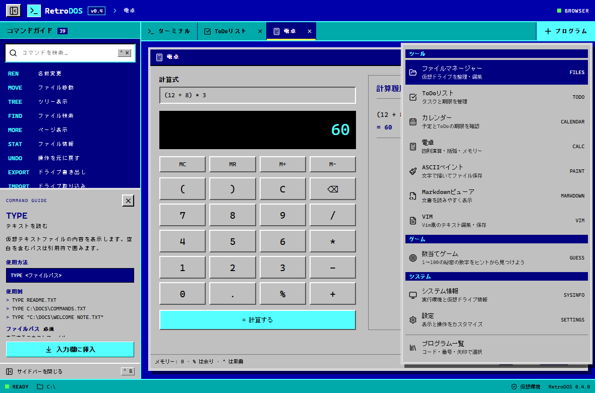
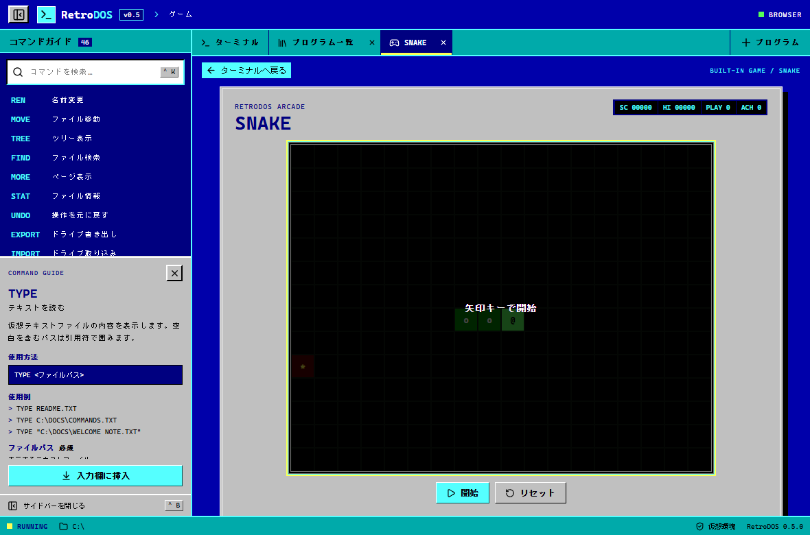
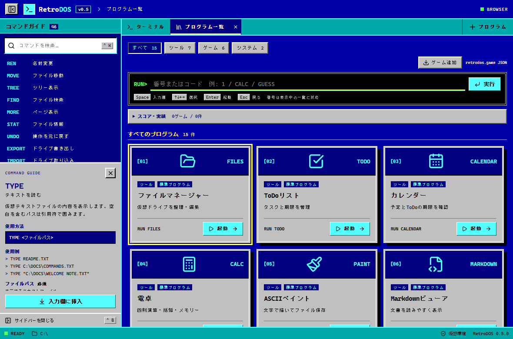

# RetroDOS

MS-DOS風のコマンド操作と、現代的なデスクトップUIを組み合わせた仮想ワークスペースです。

React + TypeScriptによるブラウザー版と、Tauri v2によるWindowsデスクトップ版を同じコードベースで提供します。現在のバージョンは **v0.5.0** です。


## 主な機能

- 青とシアンを基調にしたMS-DOS風UI
- キーボード中心のコマンド操作、履歴、Tab補完
- 開いているアプリやファイルだけを表示するタスク型タブ
- `C:\`から始まる永続的な仮想ファイルシステム
- ファイル・フォルダーの作成、編集、検索、コピー、移動、削除
- `.BAT`、`&&`、パイプ、リダイレクトを使ったシェル自動処理
- 永続的な環境変数、コマンドエイリアス、ユーザー定義コマンド
- `*`と`?`を使ったワイルドカード削除
- 最大20件の永続UNDO履歴
- Vim風の内蔵テキストエディタ
- 長文をページ単位で閲覧できるMOREページャー
- 仮想ドライブのJSONエクスポート・インポート
- ツール・ゲーム・システムをコード・番号・矢印で選べる共通プログラム一覧
- GUESS、SNAKE、MINES、BLOCKS、テキストADV、ローグライクの内蔵ゲーム
- ゲーム別ハイスコア・プレイ回数・実績の自動保存
- JSONゲームプラグインの取り込み、一覧・コマンド起動
- ファイルマネージャー、ToDo、カレンダー、電卓、ASCIIペイント、Markdownビューア
- システム情報と、配色・文字サイズ・操作を変更する設定画面
- コマンドとタブの「＋ プログラム」メニューからの起動
- 標準プログラムも共通JSONマニフェストで登録するパッケージ構成
- 520px幅から利用できるレスポンシブUI

RetroDOSが扱うファイルは、アプリ内の仮想データです。実PC上のファイルやOSコマンドを直接操作しません。

## クイックスタート

### 必要環境

- Node.js 22.12以降
- npm

依存関係は`package-lock.json`に固定しています。

### ブラウザー版

```powershell
npm ci
npm run dev
```

ブラウザーで <http://127.0.0.1:1420> を開きます。終了するときは、開発サーバーを実行しているターミナルで`Ctrl+C`を押します。

### Windowsデスクトップ版

Windows版の開発とビルドには、次の環境も必要です。

- Rust MSVCツールチェーン
- Microsoft C++ Build Tools
- Microsoft Edge WebView2 Runtime

詳しくは[Tauri v2の前提条件](https://v2.tauri.app/start/prerequisites/)を参照してください。

開発版を起動します。

```powershell
npm run desktop:dev
```

本番用の単体exeを生成します。

```powershell
npm run desktop:build
```

生成先は`src-tauri/target/release/retrodos.exe`です。Webアセットを内蔵しているため、Vite開発サーバーを起動せずに実行できます。

NSISインストーラーを生成する場合は、次のコマンドを使用します。

```powershell
npm run tauri -- build
```

`npm run dev`と`npm run desktop:dev`は1420番ポートを共有します。同時には起動しないでください。

## 基本操作

| 操作 | キー |
| --- | --- |
| コマンドを実行 | `Enter` |
| 入力履歴を移動 | `↑` / `↓` |
| コマンド名・別名を補完 | `Tab` |
| 複数の補完候補を選択 | `Tab` / `Shift+Tab` / `↑` / `↓` |
| 補完候補を入力欄へ挿入 | `Enter` |
| 補完候補を閉じる | `Esc` |
| コマンド検索へ移動 | `Ctrl+K` |
| サイドバーを開閉 | `Ctrl+B` |
| ターミナル表示をクリア | `Ctrl+L` |
| 次のタブへ切り替え | `Ctrl+Tab` |
| 前のタブへ切り替え | `Ctrl+Shift+Tab` |
| フォーカス中のタブを選択 | `←` / `→` / `Home` / `End` |
| 現在画面の入力欄へ移動 | 入力欄・ボタン以外で`Space` |
| 内蔵アプリを閉じる | `Esc` |
| プログラムメニュー内で選択 | `↑` / `↓` / `Home` / `End`、`Enter`で起動 |

サイドバーでは、コマンド名、別名、日本語名、説明を検索できます。「入力欄に挿入」はコマンドをセットするだけで、実行にはもう一度`Enter`が必要です。

過去のログを読んでいる間は、新しい出力があっても強制的に最下部へ移動しません。「新しい出力」ボタンで最新位置へ戻れます。

## コマンド一覧

### 基本操作

| コマンド | 使用例 | 機能 |
| --- | --- | --- |
| `HELP` | `HELP` / `HELP CD` | コマンド一覧または詳細を表示 |
| `CLS` | `CLS` | ターミナルの表示履歴を消去 |
| `VER` | `VER` | RetroDOSのバージョンを表示 |
| `ECHO` | `ECHO "こんにちは 世界"` | 指定した文字列を表示 |

### ファイル・フォルダー操作

| コマンド | 使用例 | 機能 |
| --- | --- | --- |
| `DIR` | `DIR` / `DIR C:\DOCS` | ファイルとフォルダーを一覧表示 |
| `CD` | `CD DOCS` / `CD ..` | 現在のフォルダーを変更 |
| `PWD` | `PWD` | 現在位置を表示 |
| `TREE` | `TREE` / `TREE DOCS` | フォルダー構造をツリー表示 |
| `FIND` | `FIND RetroDOS` | ファイル名と本文を再帰検索 |
| `TYPE` | `TYPE README.TXT` | テキストファイルをターミナルへ表示 |
| `MORE` | `MORE DOCS\COMMANDS.TXT` | テキストをページ単位で閲覧 |
| `STAT` | `STAT README.TXT` | 種類、サイズ、作成日時、更新日時を表示 |
| `MKDIR` | `MKDIR NOTES` | フォルダーを作成 |
| `VIM` | `VIM MEMO.TXT` | Vim風エディタで作成・編集 |
| `COPY` | `COPY A.TXT B.TXT` | ファイルまたはフォルダーをコピー |
| `REN` | `REN OLD.TXT NEW.TXT` | ファイルまたはフォルダーの名前を変更 |
| `MOVE` | `MOVE NOTE.TXT DOCS` | ファイルまたはフォルダーを移動 |
| `DEL` | `DEL *.TXT` | ファイルを削除。`*`と`?`に対応 |
| `RMDIR` | `RMDIR EMPTY` | 空のフォルダーを削除 |
| `RMDIR /S` | `RMDIR /S OLD` | フォルダーを中身ごと削除 |
| `UNDO` | `UNDO` | 直前のファイル操作を取り消す |
| `EXPORT` | `EXPORT DRIVE.JSON` | 仮想ドライブをJSONへ書き出す |
| `IMPORT` | `IMPORT` | JSONから仮想ドライブを復元 |

### シェル操作

| コマンド | 使用例 | 機能 |
| --- | --- | --- |
| `SET` | `SET NAME=RETRODOS` | 環境変数の設定・確認・削除 |
| `ALIAS` | `ALIAS LL=DIR` | コマンドの短縮名を登録 |
| `DEF` | `DEF GREET=ECHO Hello %1` | 引数付きユーザー定義コマンドを登録 |
| `CALL` | `CALL SCRIPTS\DEMO.BAT` | BATファイルを実行 |

### プログラム起動とシステム

| コマンド | 使用例 | 機能 |
| --- | --- | --- |
| `PROGRAMS` | `PROGRAMS` / `PROGRAMS TOOLS` | 共通プログラム一覧。TOOLS / GAMES / SYSTEMで絞り込み |
| `GAMES` | `GAMES` | 同じ一覧をゲームで絞り込んで開く |
| `RUN` | `RUN GUESS` / `RUN CALC "(12 + 8) * 3"` | コードまたは全件一覧の番号でプログラムを起動 |
| `GUESS` / `SNAKE` / `MINES` | `SNAKE` | 内蔵ゲームを直接起動 |
| `BLOCKS` / `ADVENTURE` / `ROGUE` | `BLOCKS` | 内蔵ゲームを直接起動 |
| `GAMEIMPORT` | `GAMEIMPORT C:\GAMES\EXAMPLE.RGAME.JSON` | JSONゲームプラグインを追加 |
| `GAMEPROMPT` | `GAMEPROMPT` | ジャンル・操作・UI・形式をAIと相談するプロンプトをコピー |
| `DATE` | `DATE` | 現在の日付をJSTで表示 |
| `TIME` | `TIME` | 現在の時刻をJSTで表示 |

### 標準プログラムの直接起動

| コマンド | 使用例 | 機能 |
| --- | --- | --- |
| `FILES` | `FILES DOCS` | ファイルマネージャー |
| `TODO` | `TODO` | ToDoリスト |
| `CALENDAR` | `CALENDAR` | 月間カレンダーと予定 |
| `CALC` | `CALC "(12 + 8) * 3"` | 式計算とメモリー |
| `PAINT` | `PAINT DOCS\ART.ASC` | ASCII描画とテキスト保存 |
| `MARKDOWN` | `MARKDOWN DOCS\NOTE.MD` | Markdownを整形表示 |
| `SYSINFO` | `SYSINFO` | 実行環境と仮想ドライブ情報 |
| `SETTINGS` | `SETTINGS` | 配色・文字サイズ・操作設定 |

### コマンドの別名

| 本来のコマンド | 別名 |
| --- | --- |
| `HELP` | `?` |
| `CLS` | `CLEAR` |
| `VER` | `VERSION` |
| `CD` | `CHDIR` |
| `MKDIR` | `MD` |
| `DEL` | `ERASE` |
| `RMDIR` | `RD` |
| `REN` | `RENAME` |
| `VIM` | `EDIT` |
| `STAT` | `INFO` |
| `FILES` | `FM` / `EXPLORER` |
| `CALENDAR` | `CAL` |
| `MARKDOWN` | `MDVIEW` |
| `SYSINFO` | `SYSTEMINFO` |
| `PROGRAMS` | `APPS` |

コマンド名とパスは大文字・小文字を区別しません。空白を含む引数は引用符で囲みます。

```text
TYPE "C:\DOCS\WELCOME NOTE.TXT"
VIM "C:\DOCS\MY NOTE.TXT"
MKDIR "MY FILES"
```

## v0.4 内蔵アプリ

タブ右端の「＋ プログラム」からツール・ゲーム・システムを選ぶか、上のコマンドを実行して起動します。VIM・GUESSも同じメニューに含まれます。同じプログラムを再度起動すると、そのタブへ切り替わります。各プログラムは1つのタブで動作し、タブを切り替えても作業状態を保持します。



### ファイルマネージャー

パス入力、親フォルダーへの移動、ファイル名による絞り込み、新規ファイル・フォルダー、コピー、名前変更、移動、削除、UNDOに対応します。削除前に確認画面を表示します。ファイル一覧は`↑` / `↓`で選び、`Enter`またはダブルクリックで開けます。

`.MD`はMarkdownビューア、`.ASC`はASCIIペイント、その他はVimで開きます。「Vimで編集」で拡張子に関係なく編集でき、`.BAT`には実行ボタンも表示します。コマンドやVimで変更した内容はタブに戻ると一覧に反映されます。

### ToDoとカレンダー

ToDoにはタスク名、期限、優先度を設定し、編集・完了・削除できます。未完了・完了・すべてで切り替えます。カレンダーには終日または時刻付きの予定を登録し、編集・削除できます。選んだ日の予定と期限のあるToDoを同じ画面で表示します。日付ボタン上では矢印で日を移動できます。

タスクと予定は各1000件まで自動保存し、再起動後も復元します。日時は利用環境のローカル時刻を使用し、通知・繰り返し予定には未対応です。

### 電卓

四則演算、括弧、小数、指数表記、累乗`^`、余り`%`に対応します。`Enter`で計算し、画面ボタンでも入力できます。メモリー`MC` / `MR` / `M+` / `M−`と最大20件の計算履歴を備えています。計算は数値の式として解析し、JavaScriptは実行しません。電卓の履歴とメモリーはタブを閉じるまで保持します。

### ASCIIペイント

半角ASCII文字を選び、クリック・ドラッグまたはキー入力で描画します。矢印で移動、`Space`で選択文字を描画、`Delete` / `Backspace`で消去、`Ctrl+Z`で描画を取り消し、`Ctrl+S`で保存できます。テキスト編集、消しゴム、全消去、サイズ変更にも対応します。全消去・サイズ変更・ファイル再読込は、選択中の配色に合わせたアプリ内ダイアログで確認します。`Esc`または「キャンセル」で取り消せます。最大80列×40行で、保存先を省略すると`C:\ART.ASC`を開きます。新規ファイルの親フォルダーは先に作成してください。

下書きは最大20ファイル分を自動保存します。再度開くと下書きを優先して復元し、「ファイルから再読込」で保存済みファイルに戻せます。仮想ドライブへ書き込むには「保存」または`Ctrl+S`を使います。

### Markdownビューア

「新規作成」から保存先を指定すると、空のMarkdown文書を作成してそのままVimで編集できます（拡張子を省略した場合は`.MD`を補います）。既存の文書は`MARKDOWN NOTE.MD`で開け、「Vimで編集」から編集できます。見出し、太字、斜体、コード、箇条書き、番号リスト、チェックリスト、引用、表、HTTP/HTTPSリンクを表示し、「ソース」で元のテキストを確認できます。HTMLは文字として表示し、画像やスクリプトは実行しません。表示は20万文字までで、複雑な入れ子などMarkdownの全構文には対応していません。ファイル省略時はサンプル文書を表示します。

### システム情報と設定

システム情報にはバージョン、起動環境、仮想ファイル数・本文サイズ、タブ数、ToDo件数などを表示します。画面サイズ・言語・タイムゾーン・論理プロセッサー数はブラウザー/WebViewが提供する情報です。

設定でDOSブルー・アンバー・グリーン、文字サイズ、ブラウン管風の表示、カレンダーの週始まり、出力の自動スクロールを変更できます。変更は即座に反映・自動保存されます。

`SETTINGS`を実行し、「ブラウン管風の表示」を「弱め」または「強め」にすると、画面全体に走査線・文字のにじみ・縁の陰影を加えます。配色とは独立して選べるため、DOSブルーでも使用できます。初期値は「オフ」です。

「強め」では黒いターミナルを少し明るくし、光の走査線・細かな粒子感・広がる文字の発光も加えます。粒子感は静止した表示です。

ToDo、予定、設定、ペイント下書きは仮想ドライブと別にローカル保存されるため、`EXPORT` / `IMPORT`には含まれません。ブラウザー版とデスクトップ版の保存領域も別です。

## v0.3 シェル自動化

成功した場合だけ次のコマンドを実行するには、`&&`でつなぎます。途中でエラーが発生すると、それ以降は実行しません。ディレクトリ変更は同じ入力内の後続コマンドへ引き継がれます。

```text
CD DOCS && DIR
MKDIR BUILD && CD BUILD && ECHO ready > STATUS.TXT
```

`>`は出力先を新規作成または上書きし、`>>`は既存内容の末尾へ追記します。出力先は仮想ドライブ上のテキストファイルです。

```text
ECHO hello > NOTE.TXT
ECHO second line >> NOTE.TXT
TYPE NOTE.TXT
```

`|`は左側のテキスト出力を次のコマンドへ渡します。`FIND`はパイプ入力がある場合、ファイル検索ではなく入力行の絞り込みとして動作します。

```text
DIR | FIND ".TXT"
TREE C:\ | FIND "DOCS"
TYPE README.TXT | FIND "RetroDOS"
```

環境変数は`%名前%`で展開します。`SET`だけを実行すると一覧を表示し、空の値を指定すると削除します。`%CD%`と`%ERRORLEVEL%`も参照できます。

```text
SET NAME=RETRODOS
ECHO Hello %NAME%
ECHO Current directory: %CD%
SET NAME=
```

エイリアスは実行時の引数を展開後のコマンド末尾へ追加します。`ALIAS`だけで一覧を表示し、空の割り当てで削除します。

```text
ALIAS LL=DIR
LL C:\DOCS
ALIAS LL=
```

ユーザー定義コマンドでは`%1`〜`%9`で個別の引数、`%*`で全引数を参照できます。`&&`などを含む処理本体は引用符で囲みます。`COMMAND`は`DEF`の別名です。

```text
DEF GREET=ECHO Hello %1
GREET RetroDOS
DEF BUILD="CD DOCS && DIR | FIND .TXT"
BUILD
DEF GREET=
```

環境変数、エイリアス、ユーザー定義コマンドはブラウザーまたはデスクトップアプリのローカルストレージへ保存されます。

### BATファイル

`.BAT`はファイル名を直接入力するか、`CALL`で実行します。`CALL`では`.BAT`拡張子を省略できます。

```text
CALL SCRIPTS\DEMO.BAT
SCRIPTS\DEMO.BAT
CALL BUILD release
```

BAT内では、空行、`REM`、`::`コメント、`@ECHO OFF`、`%0`、`%1`〜`%9`、`%*`を利用できます。各行で`&&`、パイプ、リダイレクト、環境変数を使用できます。エラー発生時はその行で停止します。再帰呼び出しは最大10階層、1ファイルは最大500行、1回の入力で最大500コマンドです。

## 仮想ファイルシステム

仮想ドライブは`C:`のみです。絶対パス、ルート基準のパス、相対パス、`.`、`..`を使用できます。

```text
C:\
├── GAMES\
│   └── GUESS.TXT
├── DOCS\
│   ├── COMMANDS.TXT
│   └── WELCOME NOTE.TXT
├── SCRIPTS\
│   └── DEMO.BAT
├── SYSTEM\
│   └── VERSION.TXT
└── README.TXT
```

ファイルとフォルダーの変更、および最大20件のUNDO履歴はローカルに保存されます。アプリを再起動しても内容は残ります。

### ワイルドカード

`DEL`では、ファイル名部分に`*`と`?`を使用できます。

```text
DEL *.TXT
DEL TEMP-?.LOG
DEL DOCS\OLD-*.TXT
```

ワイルドカードで削除した複数ファイルは、1回の`UNDO`でまとめて復元できます。

### ドライブのバックアップ

仮想ドライブ全体をJSONとして保存します。

```text
EXPORT
EXPORT MY-DRIVE.JSON
```

復元するときは`IMPORT`を実行し、書き出したJSONファイルを選択します。取り込み操作も`UNDO`で元に戻せます。インポートできるファイルは1MB以下です。

## Vim風エディタ

`VIM <ファイル名>`で起動すると、上部に開いたファイル名のタブが表示されます。ターミナルへ切り替えても編集状態は保持され、タブの`×`で閉じられます。

| 操作 | キー・コマンド |
| --- | --- |
| INSERTモードへ移動 | `i` / `a` / `o` |
| NORMALモードへ戻る | `Esc` |
| カーソル移動 | `h` / `j` / `k` / `l` |
| 1文字削除 | `x` |
| 1行削除 | `dd` |
| 1行コピー・下へ貼り付け | `yy` / `p` |
| 元に戻す・やり直す | `u` / `Ctrl+R` |
| 検索 | `/文字列` |
| 次・前の検索結果 | `n` / `N` |
| 行番号を表示・非表示 | `:set number` / `:set nonumber` |
| 別のファイルを開く | `:e ファイル名` |
| 保存 | `:w` |
| 終了 | `:q` |
| 保存して終了 | `:wq` |
| 変更を破棄して終了 | `:q!` |

未保存の変更がある状態で`:q`または`:e`を実行すると警告を表示します。変更を破棄して別のファイルを開く場合は`:e! ファイル名`を使います。検索は大文字・小文字を区別し、文末まで検索すると先頭へ戻ります。

## MOREページャー

`MORE <ファイル名>`で長いテキストを開きます。

| 操作 | キー |
| --- | --- |
| 次のページ | `Space` / `PageDown` |
| 1行進む | `Enter` / `↓` |
| 前のページ | `B` / `PageUp` |
| 1行戻る | `↑` |
| 先頭・末尾 | `Home` / `End` |
| 終了 | `Q` / `Esc` |

## プログラム一覧

`PROGRAMS`（別名`APPS`）で全件一覧、`GAMES`でゲームに絞った同じ一覧を開きます。ツール・ゲーム・システムのボタンでも分類を切り替えられます。番号は表示中の一覧に対応し、コードは分類をまたいで指定できます。ターミナルの`RUN 番号`は全件一覧の番号を使用します。

| 操作 | キー |
| --- | --- |
| コードで選択 | `CALC`や`GUESS`を入力して`Enter` |
| 番号で選択 | `1`を入力して`Enter` |
| 選択を移動 | `↑` / `↓` / `←` / `→` |
| 選択中のプログラムを起動 | `Enter` |
| ライブラリ・ゲームを終了 | `Esc` |

## v0.5 ゲーム環境

ゲームは一覧、タブ右端の「＋ プログラム」、`RUN <コード>`、または各コードの直接入力から起動できます。矢印キーを中心に操作でき、`Esc`で終了します。

| コード | ゲーム | 主な操作 |
| --- | --- | --- |
| `GUESS` | 数当て | 1〜100を入力して`Enter` |
| `SNAKE` | ヘビゲーム | 矢印 / WASD、`Space`で一時停止 |
| `MINES` | マインスイーパー | 矢印、`Enter`で開く、`F`で旗 |
| `BLOCKS`（別名`TETRIS`） | 落ちものパズル | 左右移動、上で回転、`Space`でハードドロップ |
| `ADVENTURE`（別名`ADV`） | LOST TERMINAL | `1`〜`9`で選択 |
| `ROGUE`（別名`DUNGEON`） | ASCIIローグライク | 矢印 / WASDでターン移動 |



ハイスコア、直近スコア、プレイ回数、勝利数、解除した実績を`retrodos.games.v1`へ自動保存します。ゲーム一覧の「スコア・実績」で全記録を確認できます。

外部ゲームは1つの`.RGAME.JSON`として追加できます。v1はスクリプトを使わない分岐型、v2はHTML・CSS・JavaScriptでアクションやパズルなども作れる隔離Webゲーム形式です。実PCのJSONはゲーム一覧の「ゲーム追加」、仮想ドライブのJSONは`GAMEIMPORT`で取り込みます。`C:\GAMES\EXAMPLE.RGAME.JSON`は分岐型の`CAVE`、`C:\GAMES\PIXEL.RGAME.JSON`はキーボードゲームの`PIXEL`です。作成時は`GAMEPROMPT`またはゲーム一覧の「ゲーム作成を相談」で[相談用プロンプト](docs/GAME-CREATION-PROMPT.md)をコピーできます。ジャンル、操作、UIデザイン、インポート形式をAIと決めてから生成します。形式は[ゲームプラグインガイド](docs/GAME-PLUGINS.md)、[JSON Schema](docs/game.schema.json)、[v1サンプル](examples/games/hello-cave/game.json)、[v2サンプル](examples/games/pixel-catch/game.json)を参照してください。



## プログラムの共通形式と外部開発

標準15プログラムも個別の`program.json`で定義し、同じカタログから登録します。表示名・分類・コード・別名・起動先をアプリとゲームで共有しています。

汎用の外部WebプログラムはHTML・CSS・JavaScriptを含む複数ファイルのパッケージとして取り込む方針です。[定義形式と今後の実装段階](docs/PROGRAMS.md)、[JSON Schema](docs/program.schema.json)、[外部プログラムの雛形](examples/programs/hello/)を用意しました。汎用プログラムの取り込みは今後の機能です。ゲームは先行して、単一JSONのv1分岐型とv2隔離Webゲームを取り込み・実行できます。

## テストと検証

```powershell
npm test
npm run typecheck
npm run build
npm run test:e2e
npm run desktop:build
npm run test:desktop
```

| コマンド | 確認内容 |
| --- | --- |
| `npm test` | シェル構文、BAT、仮想ストレージ、プログラム定義・起動、式計算、ゲームロジック |
| `npm run typecheck` | TypeScriptの型整合性 |
| `npm run build` | Vite本番ビルド |
| `npm run test:e2e` | Edge上で共通プログラム一覧・分類、8アプリ、保存・復元、シェル、Vim、MORE、ゲーム、キーボード、リサイズを操作 |
| `npm run desktop:build` | TauriのWindows releaseビルド |
| `npm run test:desktop` | 実際のWebView2でデスクトップ版を起動・操作 |

検証件数と実行結果は[実装・検証記録](docs/IMPLEMENTATION.md)に記載しています。

### プルリクエストの自動チェック

[GitHub ActionsのCI設定](.github/workflows/ci.yml)により、PRの作成・更新・再オープン・レビュー可能への変更と、`main`へのpush時に自動で検証します。GitHubの「Actions」から手動実行もできます。Node.js 22とWindows環境を使用します。

| チェック名 | 実行内容 |
| --- | --- |
| `Web tests` | `npm ci`、ユニットテスト、型検査・フロントエンドのビルド、Edgeでの画面操作テスト |
| `Windows desktop build` | `Web tests`成功後にTauriのWindows releaseビルド |

画面操作テストのHTMLレポートと、失敗時のスクリーンショット・トレースは、Actionsの実行画面の「Artifacts」に`playwright-results`として7日間保存します。PRを更新すると、同じPRの古い実行をキャンセルします。CIでは`test.only`を禁止し、画面操作テスト全体を10分で打ち切ります。

テスト成功をマージ条件にする場合は、リポジトリの「Settings → Rules → Rulesets」で`main`を対象に「Require status checks to pass」を有効にし、`Web tests`と`Windows desktop build`を指定してください。候補にはCIを一度実行した後に表示されます。

実際のWebView2を操作する`npm run test:desktop`は、Windowsのローカル環境で`npm run desktop:build`の後に実行します。

## プロジェクト構成

```text
src/
├── app/                     アプリ構成と画面名
├── components/
│   ├── layout/              タイトルバーとタブ
│   ├── sidebar/             コマンド検索と詳細
│   ├── statusbar/           パスと実行状態
│   └── terminal/            ターミナル入出力
├── features/
│   ├── apps/                内蔵アプリ、共有データ、設定、式計算
│   ├── commands/            コマンド定義、解析、実行
│   ├── filesystem/          仮想FS、永続化、MORE、入出力
│   ├── games/               6ゲーム、スコア・実績、プラグイン実行環境
│   ├── programs/            共通カタログ、標準JSON定義、一覧、起動処理
│   └── vim/                 Vim風エディタ
├── hooks/                   ワークスペースと入力状態
├── services/                実行環境の判定
├── styles/                  MS-DOS風テーマとレイアウト
└── types/                   共通型

src-tauri/                  Tauri v2のRustコードと設定
tests/e2e/                  Playwright操作テスト
scripts/                    デスクトップ検証と画面キャプチャ
docs/                       実装記録とスクリーンショット
examples/programs/          外部Webプログラムの雛形（取込・実行は今後対応）
examples/games/             宣言型ゲームプラグインのサンプル
```

コマンドは`src/features/commands/registry.ts`へ登録します。HELP、サイドバー、検索、補完は同じ定義を参照するため、追加内容が自動的に反映されます。

プログラムの登録形式は[docs/PROGRAMS.md](docs/PROGRAMS.md)を参照してください。標準のJSON定義は`src/features/programs/builtin/`にあります。

## 現在の範囲

v0.5.0では、シェル自動処理、仮想ファイル操作、8つの内蔵アプリに加えて、6つの内蔵ゲーム、永続スコア・実績、宣言型ゲームプラグインに対応しています。

次の機能は今後の対象です。

- 入力履歴、現在位置、ゲーム途中状態の再起動後の保存
- 外部DOSゲームの登録と起動
- 外部Webプログラムの取込・更新・削除と実行ホスト、標準プログラムのWebパッケージ化
- DOSBoxとの連携
- 配布用インストーラーの署名と公開
- macOS・Linux版の実機検証

Tauriにはシェルやプロセスを実行する権限を付与していません。コマンド出力はReactのテキストとして描画し、HTMLとして解釈しません。

詳しい実装履歴は[実装・検証記録](docs/IMPLEMENTATION.md)を参照してください。
